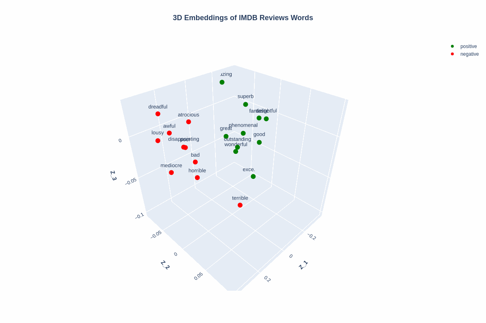
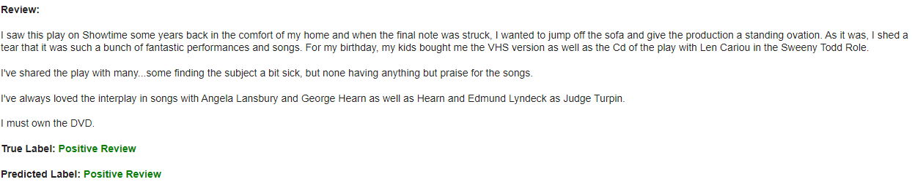
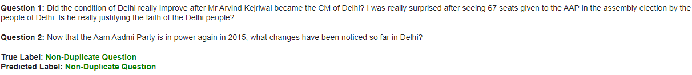

# <h1 align="center">**Text Classification**</h1>

 

This repository implements text classification models, a common task in Natural Language Processing (NLP) that assigns a label or class to a piece of text based on its content, primarily using TensorFlow and Hugging Face. The architectures are based on [LSTM](https://www.tensorflow.org/api_docs/python/tf/keras/layers/LSTM) networks and pretrained models such as [BERT](https://huggingface.co/docs/transformers/model_doc/bert) and [RoBERTa](https://huggingface.co/docs/transformers/model_doc/roberta). Additionally, the LSTM network models include the implementation and visualization of word embeddings generated after training, using [Principal Component Analysis (PCA)](https://scikit-learn.org/stable/modules/generated/sklearn.decomposition.PCA.html) from Scikit-learn to reduce the dimensionality of the trained weights in the Embedding layer.

Text classification has numerous applications, such as sentiment analysis, Natural Language Inference (NLI), Question Natural Language Inference (QNLI), duplicate questions, grammatical correctness, and more.

## **Use Cases So Far:**
1. **Sentiment Analysis:** This approach is used to determine the attitude or emotion expressed in a piece of text.

   - Multiclass text classification model to categorize [BBC news articles](https://www.kaggle.com/c/learn-ai-bbc/overview) into 5 categories: 'business', 'entertainment', 'politics', 'sport', 'tech'. This model helps organize large volumes of articles into specific categories, making it easier to search and analyze information.

   - Model to distinguish between positive and negative movie reviews in the [IMDB review dataset](http://ai.stanford.edu/~amaas/data/sentiment/). This model helps understand viewer opinions about different movies, which is useful for market research and personalized recommendations.

   - News headline classification model to determine if they are sarcastic or not using the [News Headlines Dataset for Sarcasm Detection](https://www.kaggle.com/rmisra/news-headlines-dataset-for-sarcasm-detection/home). Sarcasm detection is a significant challenge in NLP due to the subtlety of language, and this model contributes to improving accuracy in sentiment analysis and content moderation.

   - Model to distinguish between positive and negative tweets from the [NLTK Twitter dataset](http://www.nltk.org/howto/twitter.html). This model is useful for social media analysis, allowing businesses and organizations to monitor and respond to user opinions in real time.
   
2. **Duplicate Questions:** This approach is used to identify if two questions are essentially the same or are paraphrases of each other.

   - Model to determine if two questions are paraphrases of each other using the [Quora Question Pairs dataset](https://huggingface.co/datasets/nyu-mll/glue/viewer/qqp/test). This model is crucial for question-and-answer platforms as it helps prevent content duplication, improving search efficiency and the quality of provided responses.

## **Visualization of Word Embeddings Using PCA**

 

 

## **Some Results of the Predictions**

 

---

 

---

 

---

 

---

 

#### *Further results from the predictions and word embeddings can be found in their respective notebooks.*

## **Technological Stack**
 

## **Contact**

